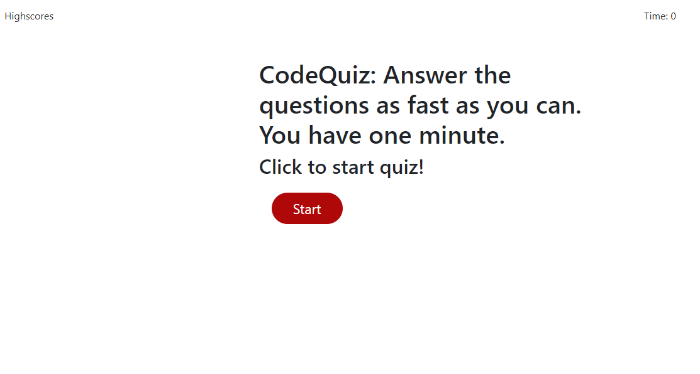
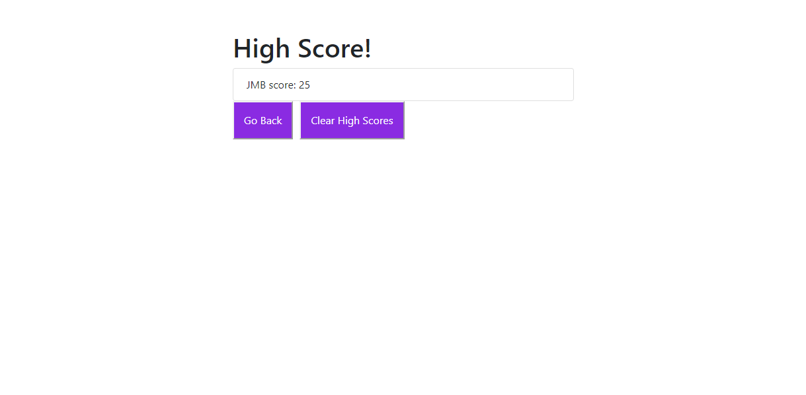

# codeQuiz

## Here is a quick code quiz that will time you and your high score will be based on the least amount of time to finish the quiz. You will be able to load your initials at end and the quiz will save high scores. You may go back and take the quiz again or you may clear the high scores.

You are required to submit the following for review:

* [The URL of the functional, deployed application.](https://findjules2.github.io/codeQuiz/)

* [The URL of the GitHub repository.](https://github.com/Findjules2/codeQuiz)

